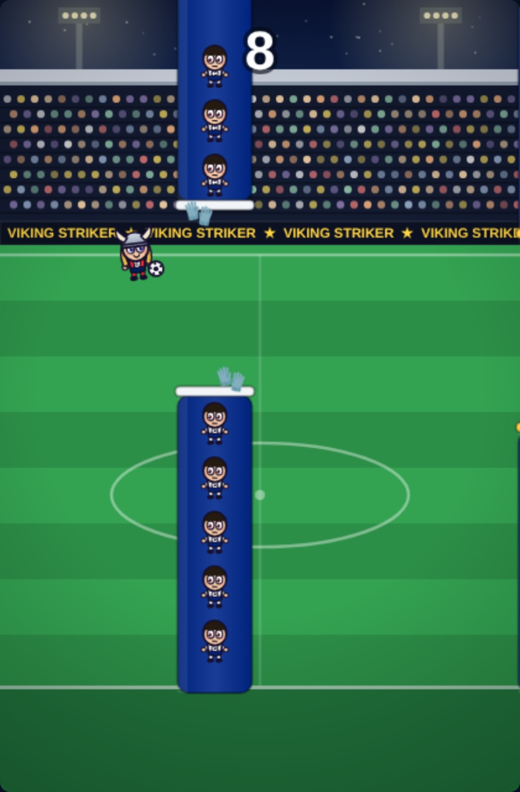
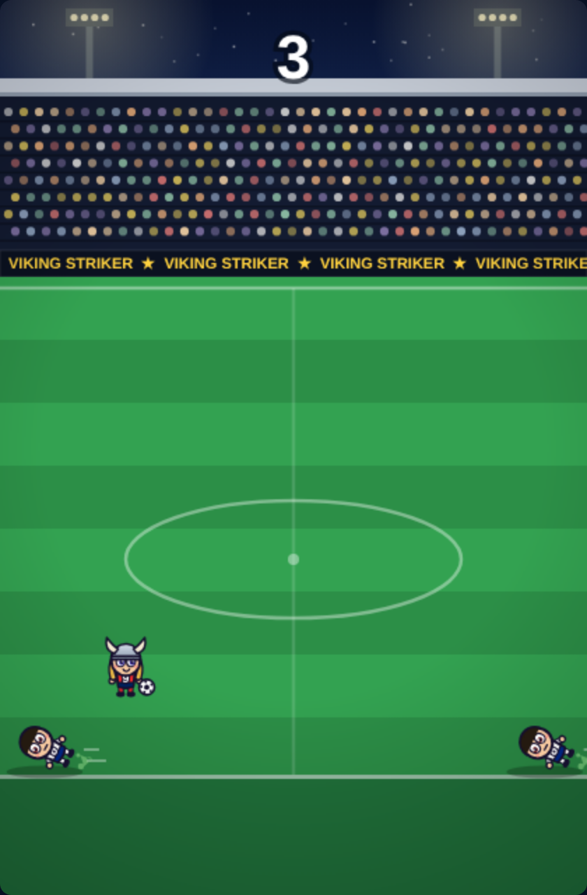
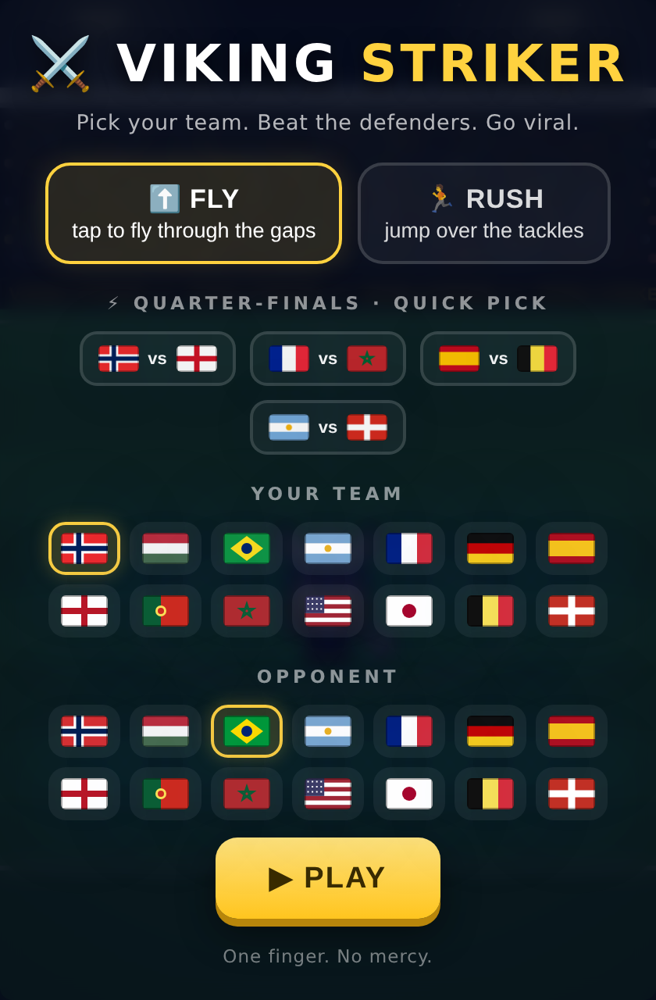
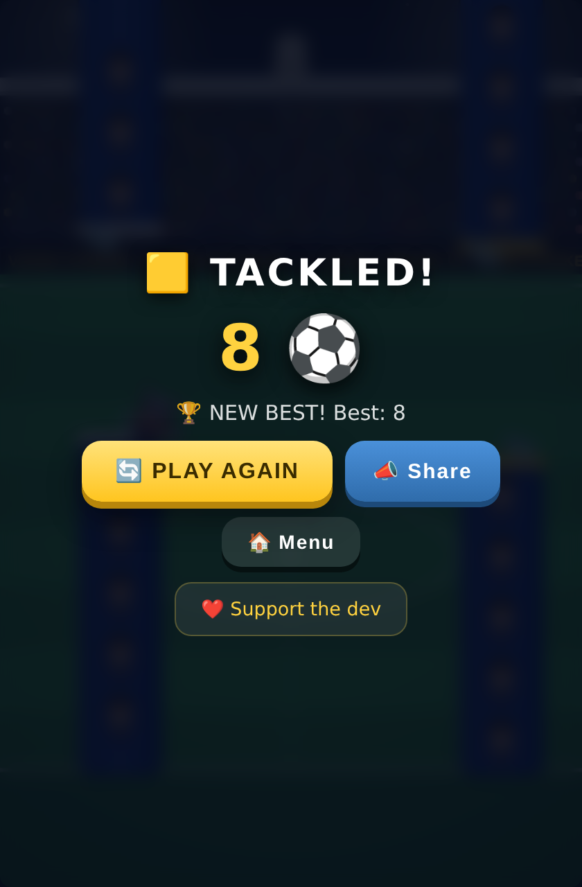

# ⚔️⚽ Viking Striker

**One-tap chibi football arcade. Pick your nation, dodge the defenders, chase the high score.**

*One finger. No mercy.*

### ▶ [PLAY NOW](https://tamerygo.github.io/viking-striker/) — free, right in your browser, on any phone or desktop. No install, no sign-up, ~33 kB.

---

## 🎮 Two ways to get past the defence

| ⬆️ FLY | 🏃 RUSH |
|:---:|:---:|
|  |  |
| Tap to fly through the gaps between defender towers. The gaps get tighter, some towers **move** — watch for the gold caps. | Jump the sliding tackles, double-jump the walls. Defenders marked with **!** charge at you. Good luck. |

## 🌍 14 national teams — and the real World Cup fixtures

Pick your team *and* the opponent whose defenders you'll embarrass. Or use the **quarter-finals quick pick** to jump straight into a real matchup.

Choosing **Norway** unlocks the full viking treatment: horned helmet and flowing golden hair. 🇳🇴

## 🕹 How to play

One finger. That's the whole tutorial.

- **Tap / Space** — fly (FLY) or jump (RUSH)
- **Tap again mid-air** — double jump (RUSH)
- Beat your best, hit **Share**, and challenge your friends.

## ✨ Under the hood

Pure HTML5 canvas in a single file — no engine, no dependencies, no assets. Hand-drawn chibi characters, procedural stadium, WebAudio sound, works offline once loaded.

## ❤️ Support

If the game made you smile, you can [support the dev](https://YOUR_SUPPORT_LINK) — it keeps the vikings fed.

## 📜 Fair play note

Fan-made parody arcade game. Not affiliated with FIFA, any federation or club. No real player names or likenesses are used — any resemblance to long-haired Norwegian goal machines is purely… coincidental. 😉
